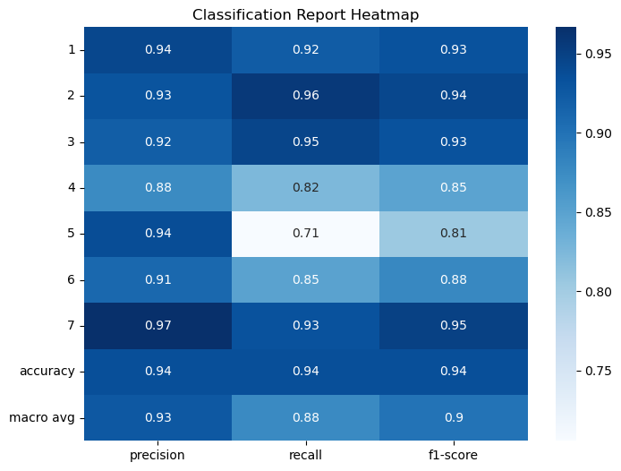

# 🌲 Forest Cover Type Prediction using RandomForestClassifier  

## 📌 Project Overview  
This project focuses on predicting **forest cover type (Cover_Type)** based on various cartographic features such as elevation, aspect, slope, distances to hydrology/roadways, hillshade values, and soil types.  
The dataset was preprocessed, cleaned, and used to train a **RandomForestClassifier**, achieving high accuracy and robust classification performance.  

---

## 📂 Dataset Information  
The dataset contains several environmental and geographical features used for classification.  

### ✅ Features Used:  
- **Numerical Features:**  
  - Elevation  
  - Aspect  
  - Slope  
  - Horizontal_Distance_To_Hydrology  
  - Vertical_Distance_To_Hydrology  
  - Horizontal_Distance_To_Roadways  
  - Hillshade_9am, Hillshade_Noon, Hillshade_3pm  

- **Categorical/One-Hot Encoded Features:**  
  - Wilderness_Area (4 binary columns)  
  - Soil_Type (40 binary columns → Soil_Type1 to Soil_Type40)  

### 🗑 Dropped Columns:  
- 3 unnamed columns (irrelevant to prediction).  

### 🎯 Target Variable:  
- **Cover_Type** (7 classes: 1–7 representing different forest cover types).  

---

## ⚙️ Data Preprocessing  
1. Removed unnecessary unnamed columns.  
2. Performed **exploratory data analysis (EDA)** using:  
   - `.head()` for dataset preview  
   - `.describe()` for statistical summary  
3. Checked for missing values and inconsistencies.  
4. Encoded categorical features (Soil_Type, Wilderness_Area).  
5. Normalized and cleaned data before training.  

---

## 🏗 Model Development  
- Algorithm: **RandomForestClassifier**  
- Trained on cartographic features to classify forest cover type.  
- Evaluated using:  
  - **Accuracy Score**  
  - **Classification Report**  
  - **Confusion Matrix**  

---

## 📊 Model Performance  

### ✅ Accuracy  
**93.51%**  

### ✅ Classification Report  

| Class (Cover_Type) | Precision | Recall | F1-Score | Support |
|---------------------|-----------|--------|----------|---------|
| 1 | 0.94 | 0.92 | 0.93 | 63,547 |
| 2 | 0.93 | 0.96 | 0.94 | 84,955 |
| 3 | 0.92 | 0.95 | 0.93 | 10,771 |
| 4 | 0.88 | 0.82 | 0.85 | 808 |
| 5 | 0.94 | 0.71 | 0.81 | 2,825 |
| 6 | 0.91 | 0.85 | 0.88 | 5,239 |
| 7 | 0.97 | 0.93 | 0.95 | 6,159 |

- **Macro Avg:** Precision: 0.93 | Recall: 0.88 | F1: 0.90  
- **Weighted Avg:** Precision: 0.94 | Recall: 0.94 | F1: 0.93  

---

### ✅ Confusion Matrix  

[[58607 4739 5 0 21 11 164]
[ 3041 81342 290 6 96 146 34]
[ 4 269 10187 49 10 252 0]
[ 0 13 106 666 0 23 0]
[ 146 640 36 0 1993 10 0]
[ 26 266 451 40 3 4453 0]
[ 282 131 0 0 2 0 5744]]


---

## 📈 Visualizations   

- ✅ **Confusion Matrix Heatmap**  
    

- ✅ **Feature Importance Plot**  
    

- ✅ **Classification Report Heatmap**  
    

---

## 🚀 Results & Insights  
- The model achieved **93.5% accuracy**, making it highly reliable for predicting forest cover type.  
- **Elevation, Soil_Type, and Hydrology distances** were among the most influential features.  
- Most cover types were predicted with high precision & recall, though **Class 5** showed relatively lower recall (0.71).  

---

## 🔮 Future Improvements  
- Experiment with **hyperparameter tuning** for RandomForest.  
- Try other advanced models such as **XGBoost, LightGBM, or Neural Networks**.  
- Handle class imbalance more effectively (especially for Cover_Type 4 & 5).  
- Deploy model as a **web app / API** for interactive predictions.  

---

## 📦 Installation & Usage  

### 🔧 Requirements  
- Python 3.x  
- scikit-learn  
- pandas  
- matplotlib  
- seaborn  
- jupyter (optional for notebooks)  

### ▶️ Run the Project  
```bash
# Clone repository
git clone https://github.com/RunseweMichael/ForestCoverType_Jupyter_Model.git

# Run Jupyter Notebook or script
jupyter notebook Forest_Cover_Prediction.ipynb


🏆 Conclusion

This project demonstrates the application of RandomForestClassifier in predicting forest cover type with high accuracy.
It highlights the importance of preprocessing, model evaluation, and feature importance analysis in building reliable ML models.
